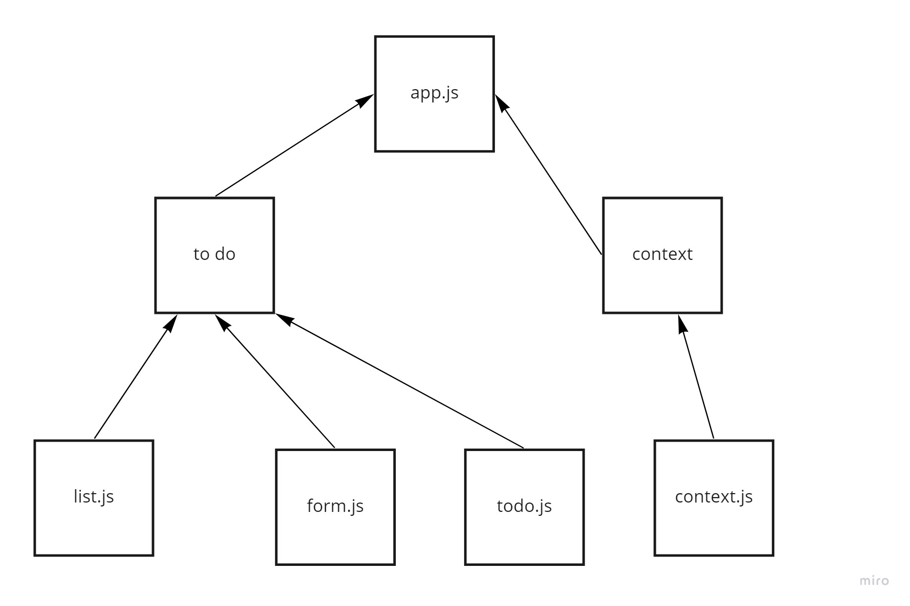

# todo-app

## Phase 1 Requirements
In Phase 1, we’re going to perform some refactoring of the To Do application as built by another team. This application mixes application state and user settings at the top level and passes things around. It was a good proof of concept, but we need to make this production ready.

## Phase 1 netlify Link
[link](https://ornate-bavarois-3f5267.netlify.app/)

## Phase 2 Requirements
In Phase 2, we’re going to extend the functionality of our application by allowing the user to make some decisions on how they would like the application to function. 

## Phase 1 netlify Link
[link](https://62852867e3de6a0de322c630--soft-banoffee-afca4b.netlify.app/)

## UML

